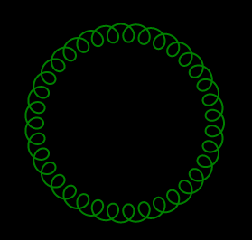

# Spiro
## Overview
Very rudimentary implementation of the old Spirograph toy.  Draws a set of nested circles, from `0` to `2*pi`.  Each circle has a `frequency` and a `radius`

## How to use
For example, this snippet of code

```
figure whatever
colour green
width 2
circle(1, 100)
circle(36, 10)
end
```

produces this image



## Can I try?

Probably, it should be hosted here [http://lyra.stikman.co.uk/spiro/Spiro.html], hopefully it'll stay put...

## How is it made?
It's written in Java, on top of [http://www.gwtproject.org/] which is effectively a cross-compiler to JavaScript.  It lets you write web applications without having to touch JS, which I think is just fab. 

The actual implementation just draws lines on a `<canvas>` element
